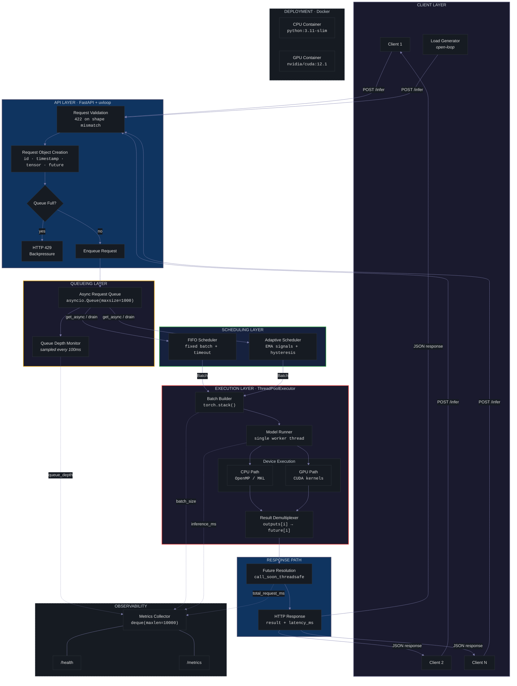
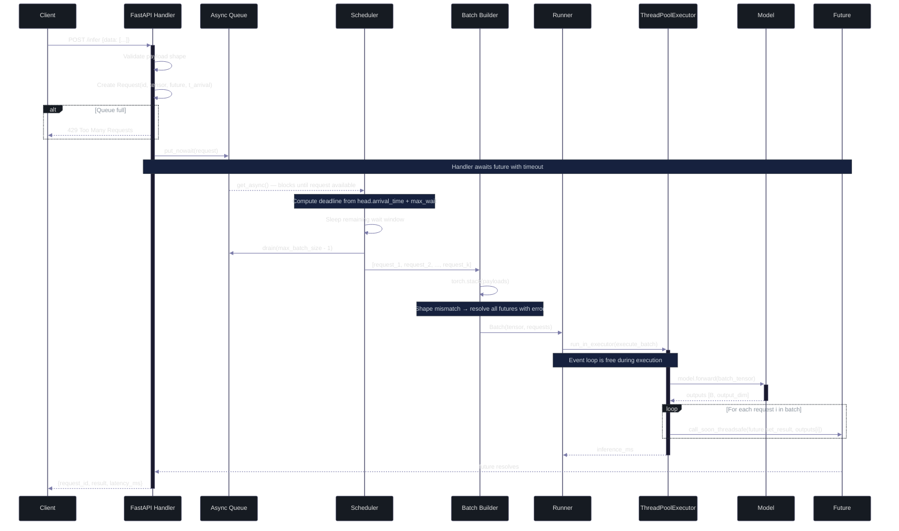
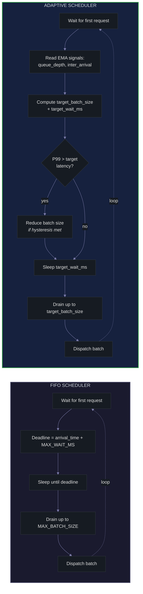

# Dynamic Batching Inference Engine (DBIE)

**Author: Biniyam Gebreyohannes**

A high-concurrency inference serving system that uses asynchronous request queueing and dynamic batching to maximize throughput while preserving low tail latency.

DBIE implements the core scheduling and execution layer found in production inference servers. It demonstrates how to transform independent, one-at-a-time inference requests into efficiently batched GPU/CPU workloads using an async producer-consumer architecture with pluggable scheduling strategies.

---

## Why This Project Exists

Serving machine learning models in production creates a fundamental tension between **throughput** and **latency**.

The naive approach — one request in, one inference out — wastes compute. Modern accelerators (GPUs, and even CPUs with vectorized math libraries) achieve significantly higher throughput when processing multiple inputs simultaneously. A GPU that takes 5ms for one input often takes only 6ms for a batch of 32.

But batching has a cost: **waiting**. To form a batch, the system must hold early-arriving requests while it waits for more to accumulate. This increases latency, particularly tail latency under light load. Under bursty traffic, the system must balance hardware utilization against responsiveness — batch too aggressively and P99 latency spikes; batch too conservatively and the hardware sits idle.

DBIE explores this tradeoff directly. It implements the request queueing, batch scheduling, and async execution machinery required to serve inference workloads efficiently, and provides two scheduling strategies (fixed FIFO and adaptive) to study how different policies affect the throughput-latency curve under varying traffic patterns.

This is an infrastructure problem, not a modeling problem. The model is intentionally simple. The engineering is in the plumbing.

---

## Core System Capabilities

| Capability | Implementation |
|---|---|
| **Async request ingestion** | FastAPI with uvloop, non-blocking request handling |
| **Bounded request queue** | `asyncio.Queue` with configurable max size |
| **Backpressure** | Immediate HTTP 429 when queue is full — never blocks the event loop |
| **FIFO scheduling** | Fixed batch size, timeout from head request arrival |
| **Adaptive scheduling** | EMA-based signals, hysteresis to prevent oscillation |
| **Batched inference** | `torch.stack` across queued requests, single forward pass |
| **Executor isolation** | Synchronous PyTorch inference runs in `ThreadPoolExecutor`, off the event loop |
| **Thread-safe result delivery** | `loop.call_soon_threadsafe()` to resolve futures from executor threads |
| **CPU and GPU execution** | Device-agnostic runner with CUDA synchronization and cache management |
| **Rolling metrics** | Bounded deques with on-demand percentile computation |
| **Warm-up** | Configurable warm-up batches before accepting traffic |
| **Containerized deployment** | Multi-stage Docker builds for CPU and GPU variants |
| **Environment-driven config** | All tunable parameters exposed as environment variables |

---

## High-Level Architecture

DBIE is a **producer-consumer pipeline** with four major stages:

1. **HTTP handlers** accept inference requests and act as **producers**, placing work into an async queue.
2. A **scheduler** monitors the queue and decides when to form a batch — balancing between waiting for more requests (higher throughput) and flushing early (lower latency).
3. A **model runner** consumes batches and executes inference in a thread pool, isolated from the async event loop.
4. **Futures** carry results back to the original HTTP handlers, which return responses to clients without ever blocking.

The core design tension that every component is built around:

> **Larger batches improve throughput and resource utilization, but increase waiting time and tail latency.**

Every configuration parameter, every scheduling decision, and every architectural boundary in DBIE exists to manage this tradeoff.

---

## System Architecture Diagram



---

## Request Lifecycle Sequence

The following diagram traces a single request from HTTP ingress through batched inference and back.



---

## Request Lifecycle: Step by Step

1. **Client sends request.** A POST to `/infer` carries a flat array of floats matching the model's input dimension.

2. **Validation.** The API layer checks the payload length. Mismatches return 422 immediately — no queue space is wasted on invalid requests.

3. **Request object creation.** A `Request` dataclass is created with four fields:
   - `request_id` — UUID for tracing
   - `arrival_time` — `time.monotonic()` timestamp, used by the scheduler to compute deadlines
   - `payload` — the input tensor, kept on CPU
   - `future` — an `asyncio.Future` that will carry the result back to this handler

4. **Queue insertion.** The request is placed into a bounded `asyncio.Queue` via `put_nowait()`. If the queue is full, the handler returns **HTTP 429** immediately — it never blocks waiting for space.

5. **Scheduler wait.** The scheduler blocks on `queue.get_async()` until at least one request is available. It then computes a flush deadline based on the **head request's arrival time** (not the current time — this prevents systematic over-waiting). It sleeps until the deadline, then drains up to `max_batch_size` requests from the queue.

6. **Batch assembly.** `torch.stack()` combines all request payloads into a single tensor of shape `[B, input_dim]`. If shapes are incompatible, all futures in the batch are resolved with the exception.

7. **Executor dispatch.** The batch is submitted to a `ThreadPoolExecutor` via `run_in_executor()`. This is the critical boundary: synchronous PyTorch inference runs in a dedicated thread, and the asyncio event loop remains free to accept new requests.

8. **Model execution.** The model processes the full batch in one forward pass. On GPU, `torch.cuda.synchronize()` ensures the result is materialized before proceeding.

9. **Result demultiplexing.** The output tensor is split along the batch dimension. Each `outputs[i]` is paired with `requests[i]`.

10. **Future resolution.** Results are delivered back to waiting handlers via `loop.call_soon_threadsafe(future.set_result, result)`. This is necessary because the executor thread cannot safely touch asyncio primitives directly.

11. **Response.** The handler, which has been awaiting the future, wakes up and returns the result with the measured end-to-end latency.

---

## Scheduler Design

The scheduler is the decision-making core of DBIE. It answers one question: **when should I stop waiting and flush the current batch?**

### FIFO Scheduler

The FIFO scheduler uses a fixed policy:

- Block until at least one request arrives.
- Set a **flush deadline** = `head_request.arrival_time + MAX_WAIT_MS`.
- Sleep until the deadline.
- Drain up to `MAX_BATCH_SIZE` requests from the queue.
- Assemble and dispatch the batch.

The timeout is anchored to the **oldest request's arrival time**, not to the moment the scheduler wakes up. This prevents the scheduler from systematically adding extra latency when it takes time to process prior batches.

FIFO is simple, predictable, and serves as the baseline strategy. It works well under steady load but cannot adapt to changing traffic patterns.

### Adaptive Scheduler

The adaptive scheduler dynamically adjusts both **batch size** and **wait time** based on observed traffic signals:

**Inputs:**
- `ema_queue_depth` — exponential moving average of the queue size at each scheduling decision
- `ema_inter_arrival_ms` — exponential moving average of time between consecutive request arrivals
- `p99_latency` — 99th percentile of recent observed latencies

**Derived policy:**
- `target_batch_size = clamp(ema_queue_depth * fill_factor, min, max)`
- `target_wait_ms = clamp(ema_inter_arrival_ms * target_batch_size, min_wait, max_wait)`
- If P99 latency exceeds the target ceiling, reduce batch size.

**Hysteresis:** The scheduler requires `N` consecutive signals in the same direction before changing the target batch size. This prevents oscillation under noisy traffic.



The adaptive scheduler is the more interesting systems component. Under bursty traffic, it increases batch size to absorb load spikes efficiently. Under light traffic, it shrinks the batch and reduces wait time to keep latency low. The hysteresis mechanism prevents it from thrashing between states when the signal is ambiguous.

---

## Concurrency Model and Systems Decisions

DBIE's architecture reflects several deliberate decisions about concurrency, isolation, and resource management.

### Why `asyncio.Queue`

The request queue is the central coordination point between producers (HTTP handlers) and the consumer (scheduler). `asyncio.Queue` provides:
- Thread-safe, coroutine-compatible get/put operations
- Built-in backpressure via `maxsize`
- Blocking `get()` for the scheduler, non-blocking `put_nowait()` for handlers

### Why handlers must never block on insertion

If a handler calls `await queue.put()` when the queue is full, it blocks — and in a single-worker ASGI server, blocking one handler starves the event loop. Every other in-flight request stalls. Instead, DBIE uses `put_nowait()` and raises `QueueFullError` immediately, returning HTTP 429. The event loop stays responsive even under overload.

### Why inference runs in a `ThreadPoolExecutor`

PyTorch's `model.forward()` is synchronous and CPU-bound. Running it directly in an async handler would block the event loop for the duration of inference — tens to hundreds of milliseconds. During that time, no new requests can be accepted, no futures can be resolved, and no health checks can respond.

`run_in_executor()` moves the blocking call to a dedicated thread. The event loop continues serving requests while inference proceeds in parallel.

### Why a single executor worker

Multiple executor threads seem like they would increase throughput, but for inference workloads they typically hurt. PyTorch uses OpenMP and MKL internally for parallelized math. Multiple threads competing for the same CPU cores cause over-subscription: context switching overhead destroys the throughput gains. A single worker ensures clean, uncontested execution.

### Why `call_soon_threadsafe`

`asyncio.Future.set_result()` is not thread-safe. Calling it from the executor thread can corrupt internal state or raise `RuntimeError` in Python 3.10+. `loop.call_soon_threadsafe()` schedules the result delivery on the event loop's thread, where it's safe.

### Why `workers=1`

Running multiple ASGI workers (e.g., `uvicorn --workers 4`) splits incoming requests across independent processes. Each process gets its own queue, its own scheduler, and its own model instance. Batching efficiency collapses because each worker sees only a fraction of the traffic. DBIE runs a single worker by design.

---

## Failure Modes and Operational Gotchas

Production inference systems fail in specific, predictable ways. DBIE accounts for these:

| Failure Mode | What Happens | Mitigation |
|---|---|---|
| **Queue overflow** | Burst exceeds queue capacity | Immediate 429 via `put_nowait()` — never blocks |
| **Tensor shape mismatch** | Mixed-dimension requests in one batch | `torch.stack` wrapped in try/except; all futures in the batch receive the exception |
| **Event loop blocking** | Synchronous model code runs on the main thread | All inference isolated in `ThreadPoolExecutor` |
| **Thread-unsafe future resolution** | `set_result()` called from executor thread | `loop.call_soon_threadsafe()` for all future resolution |
| **Client disconnect** | Client drops connection; future never awaited | `asyncio.wait_for()` with configurable timeout prevents memory leaks |
| **Cold-start latency spike** | First inference triggers JIT compilation, kernel caching | Configurable warm-up batches run before the server accepts traffic |
| **Adaptive scheduler oscillation** | Batch size thrashes under noisy traffic | Hysteresis: requires N consecutive consistent signals before adjusting |
| **Docker health check during warm-up** | Orchestrator kills container before model is loaded | `start_period: 30s` in health check configuration |
| **GPU memory fragmentation** | CUDA allocator holds fragmented memory over time | `torch.cuda.empty_cache()` called every 100 batches |

---

## Deployment Model

DBIE is designed for containerized deployment with environment-variable-driven configuration.

**Runtime architecture:**
- Single-process FastAPI server on uvicorn with uvloop
- Single ASGI worker (required for batching efficiency)
- Model warm-up completes before health checks pass
- Graceful shutdown drains the queue before terminating

**Configuration (all via environment variables):**

| Variable | Default | Purpose |
|---|---|---|
| `MAX_BATCH_SIZE` | 32 | Maximum requests per batch |
| `MAX_WAIT_MS` | 50 | Maximum wait before flushing a partial batch |
| `QUEUE_MAX_SIZE` | 1000 | Backpressure threshold |
| `INFERENCE_DEVICE` | cpu | `cpu` or `cuda:0` |
| `SCHEDULER_STRATEGY` | fifo | `fifo` or `adaptive` |
| `ADAPTIVE_TARGET_LATENCY_MS` | 100 | Latency ceiling for adaptive scheduler |
| `WARMUP_BATCHES` | 10 | Warm-up iterations before accepting traffic |
| `INPUT_DIM` | 128 | Model input dimension |
| `OUTPUT_DIM` | 64 | Model output dimension |

**Docker variants:**
- `Dockerfile` — CPU build on `python:3.11-slim`
- `Dockerfile.gpu` — GPU build on `nvidia/cuda:12.1.0-runtime-ubuntu22.04`
- `docker-compose.yml` — Both variants with health checks and GPU device reservation

---

## Repository Structure

```
dbie/
├── dbie/
│   ├── __init__.py
│   ├── __main__.py          # Entry point: python -m dbie
│   ├── config.py             # Environment-driven configuration
│   ├── models.py             # Request and Batch dataclasses
│   ├── queue.py              # Bounded async queue with backpressure
│   ├── scheduler.py          # FIFO and Adaptive scheduler implementations
│   ├── runner.py             # Model runner with ThreadPoolExecutor isolation
│   ├── metrics.py            # Rolling metrics with percentile computation
│   └── server.py             # FastAPI application, lifespan, endpoints
├── tests/
│   ├── test_config.py
│   ├── test_models.py
│   ├── test_queue.py
│   ├── test_scheduler.py
│   ├── test_runner.py
│   ├── test_metrics.py
│   └── test_server.py        # Integration tests with lifespan
├── benchmarks/
│   ├── load_generator.py     # Open-loop load generator
│   └── sweep.py              # Batch size sweep automation
├── analysis/
│   └── plots.py              # Throughput, latency, and comparison plots
├── Dockerfile                # CPU multi-stage build
├── Dockerfile.gpu            # GPU variant
├── docker-compose.yml
└── pyproject.toml
```

---

## Running Locally

**Install and start:**
```bash
python3 -m venv .venv && source .venv/bin/activate
pip install -e ".[dev]"
python -m dbie
```

**Adjust scheduling strategy:**
```bash
SCHEDULER_STRATEGY=adaptive MAX_WAIT_MS=30 python -m dbie
```

**Use GPU:**
```bash
INFERENCE_DEVICE=cuda:0 python -m dbie
```

**Send a request:**
```bash
curl -X POST http://localhost:8000/infer \
  -H "Content-Type: application/json" \
  -d '{"data": [1.0, 2.0, 3.0, ..., 128.0]}'
```

**Check metrics:**
```bash
curl http://localhost:8000/metrics | python -m json.tool
```

**Run tests:**
```bash
pytest tests/ -v
```

**Docker:**
```bash
docker compose up inference-cpu
```

---

## Benchmark Results

DBIE includes an open-loop load generator that avoids coordinated omission — requests are sent on a fixed schedule independent of response arrival, ensuring accurate latency measurement even under load.

The following benchmarks were run against the FIFO scheduler with `MAX_BATCH_SIZE=32` and `MAX_WAIT_MS=50` on CPU:

### Latency and Throughput Overview


*Left: P50/P95/P99 latency across four load patterns. Right: Achieved throughput (requests/sec). The burst pattern shows the highest latencies as the scheduler absorbs large request spikes into batches, while the ramp pattern achieves the highest throughput as gradually increasing load fills batches efficiently.*

### Latency Percentile Fan


*The fan between P50 and P99 widens under burst and step-function traffic — exactly where the batching tradeoff is most visible. Under constant load, the system maintains tighter tail latency because batch sizes stay consistent.*

### Request Success Rate


*100% success rate across all load patterns (3,463 total requests, zero failures). The backpressure mechanism (HTTP 429) was not triggered because the queue capacity of 1000 was sufficient for these traffic levels.*

---

## Why This Project Matters

DBIE demonstrates engineering skills that are directly relevant to ML infrastructure and backend systems work:

- **Async concurrency architecture** — producer-consumer pipeline with futures, executors, and event loop isolation.
- **Queueing and scheduling** — bounded queues, backpressure, and two scheduling strategies with different throughput-latency profiles.
- **Inference systems understanding** — batching, warm-up, device management, and the practical constraints of serving models in production.
- **Latency/throughput tradeoff analysis** — the entire system is built around this tension, with configurable knobs to explore the curve.
- **Systems engineering maturity** — thread safety, graceful shutdown, failure handling, observability, and containerized deployment.
- **Production awareness** — health checks, backpressure, timeout handling, memory management, and operational gotchas addressed in code.

The project sits at the intersection of backend systems engineering and ML infrastructure — the same problem space as NVIDIA Triton Inference Server, TensorFlow Serving, and vLLM's scheduling layer.

---

<p align="center">
  <sub>Built by <strong>Biniyam Gebreyohannes</strong> as a systems engineering study in high-concurrency inference serving.</sub>
</p>
